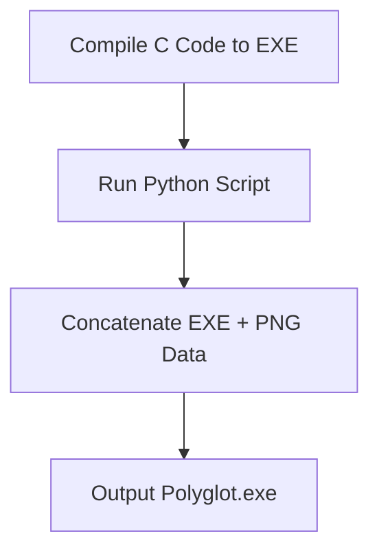
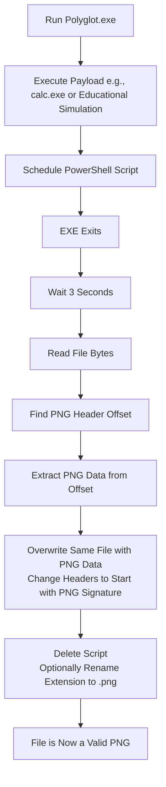
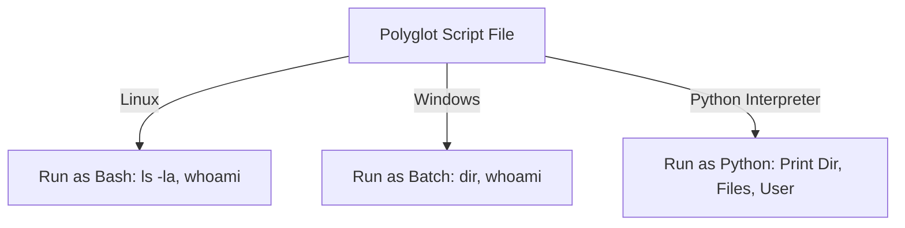

# Polyglator

This project demonstrates the concept of polyglot files through practical examples. It includes a C-based executable that can transform itself into a PNG image after execution, a Python script to create such polyglot EXE/PNG files, and an additional example of a multi-language script that works as Bash, Batch, and Python. The focus is on educational purposes to illustrate how file formats can be manipulated, with warnings against any unethical or illegal use.

**Important Disclaimer:** This project is for educational and research purposes only. It showcases techniques that could be abused for malicious activities, such as hiding malware, but you must not use it for any harmful intent. Always comply with laws and ethical guidelines. Replacing harmless commands (like launching the calculator) with actual malware is strongly discouraged and could violate security policies or laws. Instead, use benign payloads for learning, such as opening a text editor or logging system information.

## What is a Polyglot File?

In computing, a polyglot file is a single file that can be validly interpreted as multiple different formats. This is achieved by carefully structuring the file's contents to satisfy the parsing rules of two or more file types simultaneously or with minimal modification. The term "polyglot" draws from linguistics, where it refers to someone who speaks multiple languages.

### How Polyglot Files Work
Polyglot files exploit the flexibility (or leniency) in how different programs parse files:
- **File Headers and Signatures:** Most file formats start with a "magic number" or header (e.g., PNG files begin with the bytes `89 50 4E 47 0D 0A 1A 0A`). Parsers for one format might ignore leading or trailing data that doesn't match their expectations, allowing another format's data to coexist.
- **Concatenation Technique:** A simple method is appending one file's data to another. For example, an executable (EXE) loader might execute the code and ignore extra bytes at the end, while an image viewer could be tricked or scripted to extract the image portion.
- **Cavity or Overlap Methods:** More advanced polyglots embed data in unused sections (e.g., padding or comments) of a file format, making the file fully valid in both formats without extraction.
- **Security Implications:** In cybersecurity, polyglots are often used by attackers to bypass detection. For instance, a file might appear as an innocent image (e.g., PNG or JPEG) but contain hidden executable code. Malware scanners might classify it based on extension or initial header, missing the dual nature. Examples include GIFAR (GIF + RAR) or polyglot images hiding scripts.

From research:
- Polyglots can evade signature-based antivirus by masquerading as benign files.
- Real-world malware, like the "Koske" Linux cryptominer, hides in AI-generated JPEG images, deploying payloads when processed.
- Techniques like XSS polyglots use images to inject malicious code into web applications.

Polyglots highlight the importance of deep file inspection (e.g., using Content Disarm and Reconstruction tools) rather than relying on extensions or superficial checks.

## Project Overview

This project creates a polyglot file that functions as a Windows executable (EXE) but can self-transform into a valid PNG image after running its payload. The goal is to demonstrate file format manipulation for educational purposes, such as understanding evasion techniques in malware research.

Key Components:
1. **C Program (polyglot.c):** A Windows executable that runs a payload (originally launches `calc.exe` for demo) and schedules a PowerShell script to extract the embedded PNG data from the polyglot file. When the "malware" (educational payload) finishes executing, it extracts the image in the polyglot by modifying the same file: locating the PNG header, overwriting the file contents starting from that offset (effectively removing the EXE portion), changing the headers to make it a pure PNG, and optionally renaming the extension. This effectively "hides" the executable as an image post-execution.
2. **Python Script (make_polyglot.py):** A tool to combine a compiled EXE with a PNG file, creating the polyglot by simple concatenation.
3. **Multi-Language Script Example (polyglot_script.py):** A separate demo of a true polyglot that runs as a Bash shell script on Linux, a Batch file on Windows, or Python code cross-platform, using clever commenting and syntax.

The project illustrates a workflow where an EXE runs, performs an action, and then disguises itself as an image to potentially evade forensic analysis. For education, the payload is harmless, but in research contexts, it shows how similar techniques could hide malware (e.g., by replacing the calculator launch with a simulated payload like logging system info).

## Workflow Explanation

The workflow simulates a self-destructing executable that hides as an image after execution, a technique researched in malware evasion. Here's a step-by-step breakdown, based on code analysis and research into similar polyglot malware (e.g., image-hiding campaigns like Koske). When the payload finishes, the extraction happens in the same file by overwriting with the image data, adjusting headers to ensure it's recognized as a PNG.

1. **Preparation (Creating the Polyglot):**
   - Compile the C code into an EXE (e.g., `myprog.exe` using a compiler like MinGW: `gcc polyglot.c -o myprog.exe`).
   - Use the Python script to concatenate the EXE with a PNG: `python make_polyglot.py myprog.exe myimage.png polyglot.exe`.
   - **How it Works Internally:** The Python script reads the EXE bytes, appends the PNG bytes, and writes to `polyglot.exe`. The resulting file is a valid EXE because Windows PE loaders ignore trailing data after the executable sections.

2. **Execution (Running as EXE):**
   - Run `polyglot.exe` on Windows.
   - The C code executes:
     - Runs the payload: `system("calc.exe")` (launches Windows Calculator as a demo; for research, replace with educational malware simulation like `system("echo Simulated payload > log.txt")`).
     - Calls `scheduleModification()`:
       - Gets the current EXE path.
       - Creates a PowerShell script (`modify_delayed.ps1`) on disk.
       - The script waits 3 seconds (to allow the EXE to exit).
       - Reads the EXE bytes, searches for the PNG header (`0x89 50 4E 47`).
       - If found, extracts from the header to the end, overwrites the same file with this PNG data (modifying in place), effectively changing the file's headers and content to be a pure PNG starting with the correct signature.
       - Deletes the script itself; optionally renames the file extension to `.png` for immediate image recognition.
     - Launches the PowerShell script in the background (hidden window, bypassing execution policy).
   - The EXE exits, but the script runs shortly after, completing the transformation.

3. **Post-Execution Transformation (In-Place Extraction):**
   - The PowerShell script activates:
     - Locates the PNG offset in the file.
     - Slices the PNG data and overwrites the original file with it, shifting the content so the PNG header is at the beginning (changing headers to make it a valid PNG).
     - Result: The same file now starts with the PNG signature and contains only image data, turning it into a valid PNG without creating a new file.
     - Cleans up the script.
   - Result: The HEART
The malicious-looking EXE "transforms" in place, becoming an innocent PNG. Opening the file (after renaming extension if needed) shows the image, hiding any traces of the executable.

4. **Research Insights on Similar Workflows:**
   - **Malware Hiding in Images:** Techniques like this are used in real attacks. For example, the Koske malware hides cryptomining code in JPEGs generated by AI. The image is delivered innocently, but when renamed or processed, it deploys the payload. Polyglots bypass AV by appearing benign.
   - **Evasion Mechanism:** EXE loaders ignore trailers; image parsers can be scripted to skip leaders. In this in-place modification, the file is rewritten to start with the image header, making it directly openable as an image.
   - **Detection Challenges:** Tools like `file` command might identify only the primary format. Security solutions use deep scanning to detect polyglots.
   - **Educational Replacement for Payload:** For research, replace `system("calc.exe")` in the C code with a benign command like `system("notepad.exe")` or a custom function (e.g., logging). Do not use actual malware; this is for studying workflows only. Example modification:
     ```c
     // Replace this:
     // system("calc.exe");
     
     // With your educational payload (high-level example only):
     // system("your_ethical_command_here");  // e.g., "echo Hello > log.txt" for logging
     ```
     Recompile and recreate the polyglot. Remember, any real malware creation is illegal and unethical.

5. **Cleanup and Verification:**
   - After running, the same file is now a PNG (rename to `.png` if not already).
   - Verify it opens as an image.

### directory structure
Polyglator/
├── README.md                       # Documentation (the one we just wrote)
├── make_polyglot.py                 # Python script to combine EXE + PNG
├── polyglot_main.c                  # C source for the polyglot EXE
├── modify_delayed.ps1               # Generated automatically by the C program
├── myprog.exe                        # Your demo executable (e.g., calc.exe or safe program)
├── myimage.png                       # Image to embed
├── kio5.bat                         # the Multi-Language polyglot Script  (linux, windows, python) rename it to .sh for linux , .bat for windows , .py for python
├── output/
│   └── polyglot.exe                 # Generated polyglot EXE
└── extracted/
    └── polyglot.png                 # Generated after scheduled rewrite


### Workflow Diagrams

Below are diagrams illustrating the workflows using Mermaid syntax (renderable on GitHub or with Mermaid tools).

#### Polyglot Creation Workflow


#### Execution and Transformation Workflow


#### Multi-Language Script Workflow


This workflow educates on file format abuse but underscores the need for robust security practices.

## Usage

### Requirements
- Windows for EXE demo (with PowerShell enabled).
- Python 3 for the maker script.
- Compiler for C (e.g., GCC via MinGW).
- A sample PNG image.

### Steps
1. Compile the C code: `gcc polyglot.c -o myprog.exe`.
2. Create polyglot: `python make_polyglot.py myprog.exe myimage.png polyglot.exe`.
3. Run `polyglot.exe` and observe (Calculator opens, then file transforms in place to PNG).

### Demo exe- png

https://github.com/user-attachments/assets/4a9861d3-1707-4085-b082-7d5b0b0cc69d

### Multi-Language Script Demo
Save the third snippet as `polyglot_script` (no extension) and run:
- On Linux: `./polyglot_script` (Bash mode: lists files, shows user).
- On Windows: `polyglot_script` (Batch mode: dirs files, shows user).
- With Python: `python polyglot_script` (Python mode: prints dir, files, user).

This uses colons and at-symbols as comments/no-ops across languages.

### Demo Multi-Language polyglot Script  (linux, windows, python)

https://github.com/user-attachments/assets/d79deca2-deff-472d-bc3b-6b52d1170612

## License
MIT License – Use at your own risk for education only.
